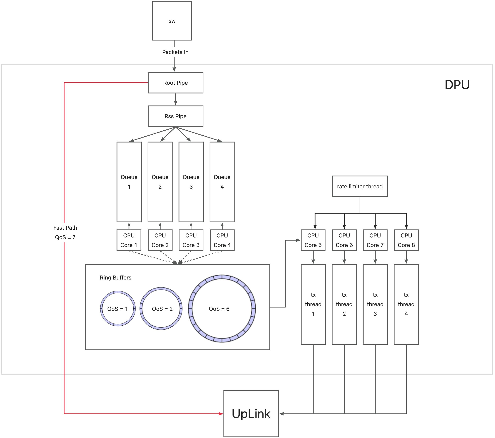

**项目链接：**[**https://github.com/sunxi11/dpu-cc**](https://github.com/sunxi11/dpu-cc)


# 1、系统架构



1. 优先级和端口绑定，最高优先级直接走 fast path ，通过硬件路径转发到 uplink （host）
2. 在线程上把收报和发包接耦，4个线程进行收包，4个线程进行发包
3. 把收包的内存分成6个部分，每个部分抽象成一个环形缓冲区，优先级越高，对应的环形缓冲区越大（丢包越少）
4. 单独一个线程进行限速，当读取到 host 堵塞时（按照一定的策略）进行限速操作


# 2、运行方法
```shell
/home/ubuntu/sunxi/simple_fwd_vnf/cmake-build-dpu-soc/simple-fwd-vnf -a auxiliary:mlx5_core.sf.4,dv_flow_en=2 -a auxiliary:mlx5_core.sf.5,dv_flow_en=2 -- -l 60 -o -a
```


